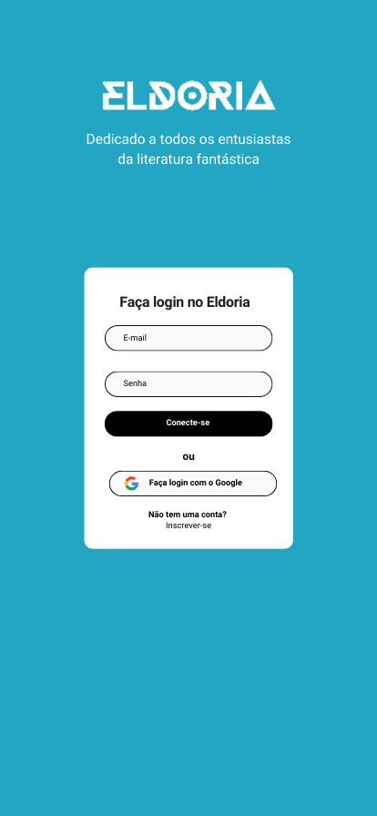
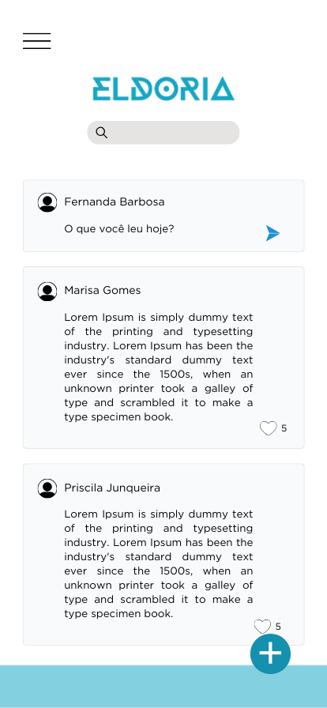
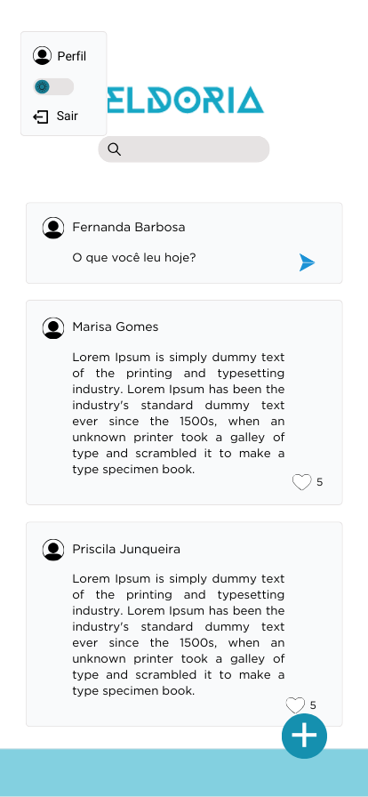
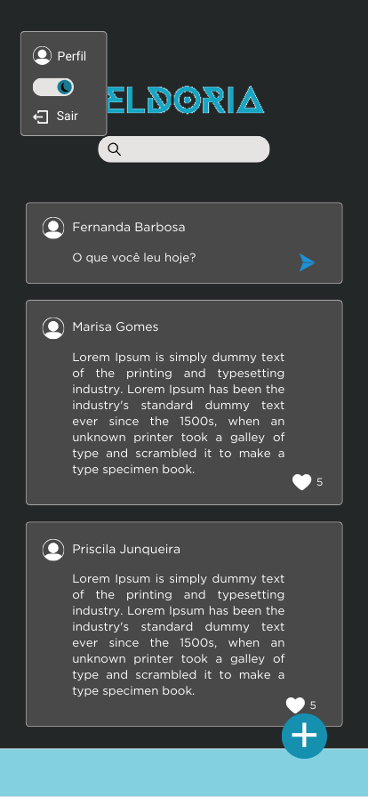
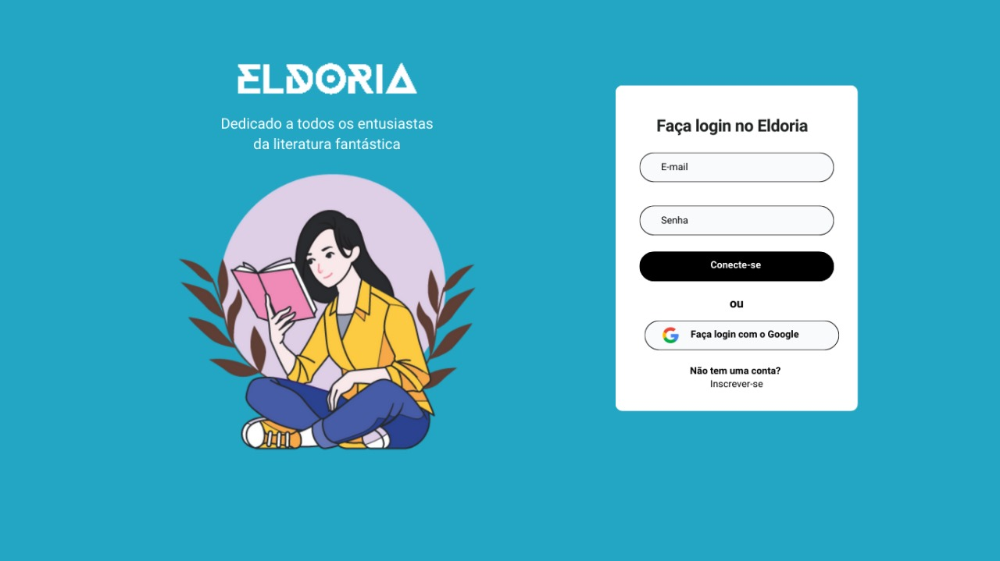
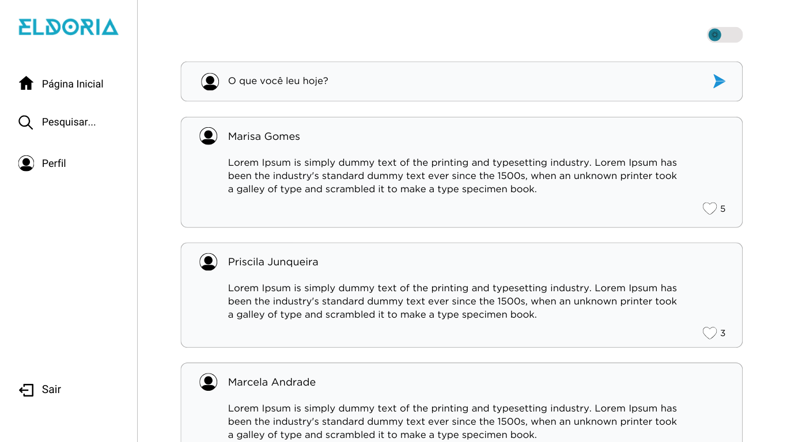
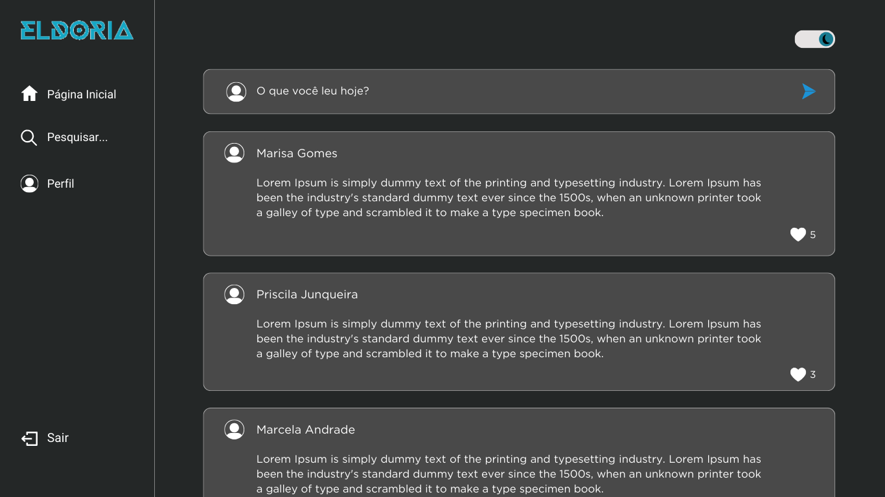
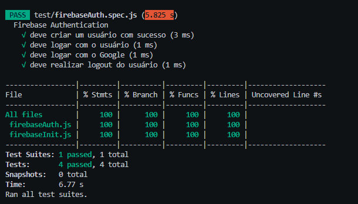

# Social Network 📱💻

## Índice

* [1. Prefácio](#1-prefácio)
* [2. Resumo do projeto](#2-resumo-do-projeto)
* [3. Sobre o tema e usuários](#3-sobre-o-tema-e-usuários)
* [4. Protótipos](#4-protótipos)
* [5. Testes de usabilidade](#5-testes-de-usabilidade)
* [6. Interface do projeto e objetivos alcançados](#6-interface-do-projeto-e-objetivos-alcançados)
* [7. Testes unitários](#7-testes-unitários)
* [8. Ferramentas e tecnologias utilizadas](#8-ferramentas-e-tecnologias-utilizadas)
* [9. Melhorias futuras](#9-melhorias-futuras)
* [Créditos](#créditos)
* [Autores](#autores)

***

***
## 1. Prefácio 📌

O projeto é uma aplicação web SPA (Single Page Application) em mobile first criada como parte do Bootcamp da Laboratoria, com o principal objetivo de desenvolver uma rede social na qual o usuário possa se cadastrar e fazer login utilizando o e-mail e senha cadastrados, ou, se preferir, usando a conta do Google. Além disso, o usuário poderá publicar na timeline, editar ou excluir suas publicações, e também visualizar as publicações de outros usuários e interagir curtindo essas publicações.

## 2. Resumo do projeto ✏️
Dentre várias possibilidades de temas, decidimos criar uma rede social para leitores do gênero de fantasia, permitindo que compartilhem indicações sobre leitura, livros e atualizações sobre os livros que estão lendo no momento, bem como suas impressões e tudo relacionado ao universo da leitura. A rede social Eldoria possibilita aos usuários compartilharem informações relevantes sobre o universo da leitura, além de interagir com outros usuários curtindo suas publicações.

## 3. Sobre o tema e usuários 💬

Reflita e depois enumere os objetivos que quer alcançar e aplique no seu projeto. Pense nisso para decidir sua estratégia de trabalho.

### História usuário 1

Como leitor eu quero poder compartilhar dicas sobre leitura para beneficiar outros leitores.

**Critérios de aceitação**

- Quero ter uma página inicial para login;
- Quero que o site tenha uma caixa de texto para fazer as minhas publicações;
- Quero poder acessar facilmente de qualquer dispositivo.

### História usuário 1

"Como leitor eu quero poder compartilhar dicas sobre leitura para beneficiar outros leitores."

**Critérios de aceitação**

- Quero ter uma página inicial para login;
- Quero que o site tenha uma caixa de texto para fazer as minhas publicações;
- Quero poder acessar facilmente de qualquer dispositivo.

### História usuário 2

"Como leitor quero poder indicar livros para beneficiar novos leitores."

**Critérios de aceitação**

- Quero ter uma página inicial para login ou cadastro;
- Quero que o site tenha uma caixa de texto para fazer as minhas publicações;
- Quero poder visualizar outras publicações no meu feed;
- Quero poder acessar facilmente de qualquer dispositivo.

### História usuário 3

"Como leitor quero poder curtir os posts que me identifico para interagir com outros leitores."

**Critérios de aceitação**

- Quero ter uma página inicial para login;
- Quero poder curtir publicações de outros usuários;
- Quero poder acessar facilmente de qualquer dispositivo.

### História usuário 4

"Como usuário gostaria de poder fazer alterações nos meus posts para poder adicionar ou retirar informações."

**Critérios de aceitação**

- Quero ter uma página inicial para login;
- Quero que nos meus posts tenha as opções de editar e excluir a publicação e que caso eu desista dessas opções eu tenha a opção de cancelar a ação;
- Quero poder acessar facilmente de qualquer dispositivo.

### História usuário 5

"Como usuário eu quero poder ter um cadastro no site para manter minhas informações salvas."

**Critérios de aceitação**

- Quero ter a possibilidade de me cadastrar no site através do meu e-mail ou da minha conta Google;
- Quero poder acessar facilmente de qualquer dispositivo.

### Definição de pronto
- Ser uma SPA.
- Ser responsiva.
- Receber code review de pelo menos uma parceira de outra equipe.
- Fazer testes unitários.
- Fazer testes manuais buscando erros e imperfeições simples.
- Fazer testes de usabilidade e incorporar o feedback dos usuários como melhorias.
- Fazer deploy do aplicativo e marcar a versão (git tag).

## 4. Protótipo 🎨

O protótipo foi desenvolvido levando em consideração as necessidades dos usuários, para que fosse uma rede social intuitiva e de fácil acesso. Pensando na usabilidade e conforto visual, optamos por adicionar um switch para que o usuário possa escolher usar a rede social no modo light ou dark.

### Protótipo de alta fidelidade

**Mobile**

   

**Desktop**

 

## 5. Testes de usabilidade 📝

Os testes de usabilidade foram realizados em média com 3 pessoas, para entendermos se a interface criada no protótipo estava intuitiva e de fácil compreensão para os usuários. Com isso, identificamos que alguns botões e a caixa de pesquisa precisariam de pequenos ajustes, na cor e alinhamento. Alguns usuários destacaram que para visualização da timeline seria melhor diminuir a quantidade de publicações que aparecem na timeline. Sendo assim, implementamos as alterações de acordo com os feedbacks recebidos durante os testes de usabilidade.

## 6. Interface do projeto e objetivos alcançados ✨

Para que pudéssemos ter um bom aproveitamento dos dados a serem manipulados, seguimos a seguinte forma:

- Elaboramos as narrativas dos usuários;
- Produzimos um protótipo de baixa fidelidade para testar rapidamente as primeiras ideias, e o protótipo de alta fidelidade foi criado para simular uma experiência mais realista;
- Conduzimos testes de usabilidade para avaliar a forma como os usuários interagem com o produto, identificando possíveis problemas de utilização e áreas de melhoria;
- O desenvolvimento foi guiado pelas fases anteriores, incorporando os feedbacks recebidos e efetuando adaptações conforme necessário.

### Os objetivos gerais alcançados no projeto:

[✔] Permite ao usuário interagir com a interface para obter as informações que necessita;

[✔] É responsiva, ou seja, pode ser visualizada sem problemas a partir de diversos tamanhos de tela: celulares, tablets, notebooks, etc;

[✔] A interface segue os fundamentos do design visual;

[✔] Testes unitários cobrem um mínimo de 70% de statements, functions, lines e branches.

'Inserir um GIF ou captura de tela da versão final aqui'

## 7. Testes unitários 🤓

Foram realizados 4 testes unitários, cobrindo 100% do código.

## 8. Ferramentas e tecnologias utilizadas 💻

- HTML5
- JavaScript
- CSS3
- Firebase
- Vite
- GitHub
- Git Bash
- Visual Studio Code
- Canva
- Figma
- Marvel App
- Trello

## 9. Melhorias futuras 🛠

- Implementar outras formas de interação entre os usuários, como: comentários nas publicações;
- Criar uma seção dedicada ao perfil do usuário com suas informações para que o usuário possa alterar seus dados, como: nome, e-mail, nome de usuário e foto;
- Permitir que quando o usuário faça o login pelo Google, sua foto seja utilizada na rede social também.

### Créditos
[Google fonts](https://fonts.google.com/icons)

[Font Awesome](https://fontawesome.com/)

### Autores
O projeto foi desenvolvido por:

👩‍💻 Ádila Freitas - [LinkedIn](https://www.linkedin.com/in/adilamarcelefreitas/) | [GitHub](https://github.com/adilamarcelefreitas) 

👩‍💻 Iana Rodrigues -  [LinkedIn](https://www.linkedin.com/in/ianarodrigues/) | [GitHub](https://github.com/ianarodrigues) 

👩‍💻 Laura de Freitas - [LinkedIn](https://www.linkedin.com/in/lauradefreitas/) | [GitHub](https://github.com/lauradefreitas2) 
